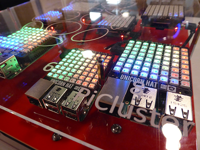

# What you will need

## Hardware
Most of the tasks in this resource just require a computer system running Python 3.

To complete the final task, you will need an OctaPi. For instructions on how to build one, see [Build an OctaPi](rpi-python-build-an-octapi).

## Software
- Python 3
