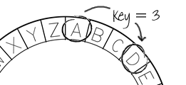

# What is public key cryptography?

Although you might not realise it, you probably use public key cryptography on a daily basis. When visiting a web page, you may have noticed a small padlock in the address bar, and an address beginning with `https`, like this:

  

This padlock means that when you communicate with the web page, the information that you send is only readable by that web page, and the information that it sends back is only readable by you. The website uses **public key cryptography** to keep your information secure. Public key cryptography provides two useful properties: __encryption__ (preventing unauthorised access to the data) and __authentication__ (proving that the person sending or receiving is who they claim to be).

**Why did GCHQ keep the discovery of public key cryptography secret in the 1970s?**

--- collapse ---
---
title: Answer
---

GCHQ is part of the team that protects the UK, along with law enforcement and other intelligence agencies. They defend government systems from attack, provide support to the armed forces, and strive to keep the public safe, in the physical world and online. In the 1970s, this involved creating cryptographic systems to protect government and military communications, and to be effective, the systems had to remain secret. When James Ellis died in 1997, GCHQ decided to reveal the story of how public key cryptography was developed. Today, GCHQ works with industry, academia, and other parts of government to improve cybersecurity in the UK by promoting the development of new cryptographic techniques, as much as possible without using secrecy.

--- /collapse ---

## How does traditional encryption work?

You may have come across simple encryption methods before, such as the Caesar cipher. Here is a project that you could try that uses a [Caesar cipher](https://projects.raspberrypi.org/en/projects/secret-messages).

In this method, a numerical key is used to encrypt a message. The letters of the alphabet are transposed forwards by the number of places given by the key, so if the key is 3, the letter A becomes D, the letter B becomes E, and so on. The alphabet is considered to wrap around, so the letter Z would become C.

  

A message is encrypted using the key, and the receiver uses the same key to decrypt the message. The key needs to be agreed by both sides beforehand, and must be kept secret.

### Test your understanding

**Does the Caesar cipher use a public or a private key?**

--- collapse ---
---
title: Answer
---

The key must be kept private, otherwise anyone could decrypt the information.

--- /collapse ---

**Does the Caesar cipher offer any authentication?**

--- collapse ---
---
title: Answer
---

No — anyone could send an encrypted message if they knew the key, and there is no way of proving who created a message.

--- /collapse ---

**If you intercepted a message encrypted using a Caesar cipher, how would you go about decrypting it if you do not know the key?**

--- collapse ---
---
title: Answer
image: images/https.png
---

Try all possible keys (there are only 25) until you find the correct one. This is known as a brute-force attack.

--- /collapse ---
