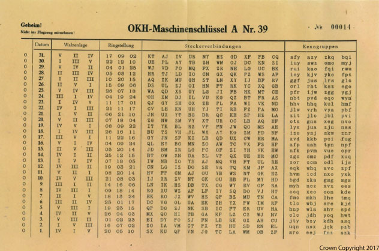

# Private keys

Prior to the invention of public key cryptography, sharing of private keys was needed for encryption and was largely done in writing. For example, in World War II a German Enigma operator had to look up each day's settings in a key list which was established beforehand and given to each operator.

*Crown Copyright 2017. Image from GCHQ archives.*

## Spot the weaknesses

Imagine you are an adversary trying to read the encrypted message that Alice sent to Bob. You already have the message and the public key.

**What information do you need to obtain to be able to decrypt the message?**

--- collapse ---
---
title: Answer
---

To be able to decrypt the message, you must find out Bob's private key.

--- /collapse ---

**How could you try to obtain this information?**

--- collapse ---
---
title: Answer
---

You could try to obtain this information in two ways:

- Break into where Bob stores his private key and steal it. This might involve both physical security measures (guards, CCTV, locked rooms) and electronic security measures. While it may work, it is likely that Bob will find out if you steal his key and that he and Alice will generate a different set of keys for future messages.
- Try to work out both private keys by searching for the two prime factors of the public key using a program. If you succeed, Bob will not know his key has been compromised and you can continue to read future messages undetected.

In order to obtain Bob's key by working out the prime factors of the public key, you will need to launch a **brute-force attack**. This means you will try all of the possible solutions in turn until you find one which works.

--- /collapse ---
