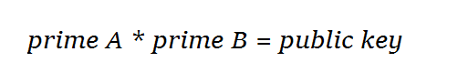

# OctaPi: Public Key Cryptography (Part 2)

So far you have learnt that although finding the factors of small numbers is easy, it quickly becomes very difficult to find the factors of large numbers, even using the power of a computer. This is in essence what protects encrypted messages: a hard maths problem. So a good public key that creates strong cryptography needs to be a very large number. You have also learnt that a suitable public key must have exactly two factors (other than itself and 1) and that this can be achieved using prime factors.

## Generating a public key

Generating a very large number to use as a public key with exactly two factors might seem difficult if you approach the problem by examining potential keys and working out if they have two factors or not.


However, the problem becomes much easier to solve if you approach it by first choosing two factors as private keys and then multiplying them together to make the public key. The two chosen factors must be **prime numbers** because then we know that the factors themselves have no factors, and it is guaranteed that there is exactly one solution to the problem of finding the private key - you can only find it by multiplying these two numbers together.



To generate the public key, two prime numbers A and B need to be selected as the private keys. The public key is then the product of the two, AB = A * B.

## Can I just choose my favourite prime number as my private key?

No. It is important that the prime numbers are __randomly chosen__ - and randomness is something human beings are very bad at! In fact, many weaknesses in encryption are caused by the behaviour of human beings rather than the failure of technology. Let's investigate why randomness in a computer system (known as *entropy*) is important.

You have probably used some Python code similar to this before to generate a random integer:

```python
import random
print( random.randint(1, 10000) )
```

### Question 1

If we ask Python to generate large random numbers until one is prime, is that good enough to use as a private key?

### Investigation

1. Open Python 3 and create a new file. Save your file as `random_seed.py`

1. Type in the following code which generates 10 random numbers between 1 and 10000

    ```Python
    import random

    random.seed(12345)

    for i in range(10):
        print( random.randint(1, 10000) )
    ```

1. Run your program by pressing F5 and look at the output. Then, run your program again. What do you see?

### Answer

Python's `randint` function generates numbers that appear random, but because the we added a starting number (or **seed**), if the seed is unchanged each time the code is run, the same sequence of numbers in the same order will always be generated. Using this function to choose our primes is not cryptographically secure, because if an attacker can determine the seed we used, they could simply use it to regenerate all the "random" numbers that were chosen.

### Question 2

So why can't we just use this function but not specify a seed?

### Investigation

1. Delete the line `random.seed(12345)`.

1. Run the program multiple times and compare the output. What happens now?

### Explanation

Although the numbers we have generated now _appear_ to be different each time, they are still not genuinely random. This is because the algorithm used to generate the prime numbers still needs a seed - the seed still exists, we just don't know what it is! If we don't specify one, the seed is generated in the background, usually based on a changing value such the current time. This explains why each time we run the program the numbers are different and appear to be random. However, if an attacker could work out what the seed was, they could easily generate the same random numbers we did and thus they could find out the factors we chose.

If you are interested in reading more about this topic you could research the **Mersenne twister** algorithm which Python uses to generate its pseudo-random numbers.

### Solution

Because the amount of randomness (known as **entropy**) is extremely important when choosing prime numbers to use as a key, a public key encryption algorithm must use a cryptographically secure source of random numbers. For example Python can use a method `os.urandom()` in the `os` library.

There are many ways in which **entropy** can be increased in a computer system, here are just a few:
- Using operaring system sources. Examples include the system time, keyboard strokes and mouse movements.
- Using radioactive decay, which is the decay of the nucleus of atoms from one element to another. As this happens randomly, we can use the time difference between decay events to generate random seeds.
- Semiconductor junction noise. Semiconductors are used in many electronic components (including computers). A diode is a type of component that conducts electricity in only one direction using a junction between two types of semiconductor material. When current is flowing in the allowed direction, noise is generated which can be sampled in amplitude and used as a random seed. This is how a, so called, Entropy Key works.   

A lack of entropy is a challenge with Internet of Things devices where encrtption techniques, such as public key cryptography, is important because sensors and actuators used in real world applications cannot access sources of randomness such as those listed above.
