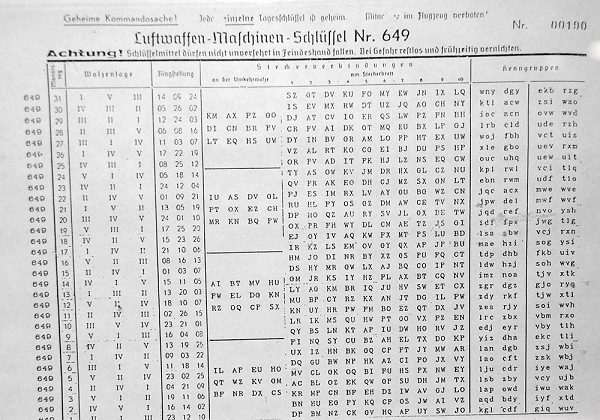

## How are private keys shared?

Prior to the invention of public key cryptography, sharing of private keys needed for encryption was largely done in writing. For example, in World War 2 a German Enigma operator had to look up each day's settings in a key list which was established beforehand and given to each Enigma operator.

*https://commons.wikimedia.org/wiki/File:Enigma_keylist_3_rotor.jpg#/media/File:Enigma_keylist_3_rotor.jpg* (Public domain)
