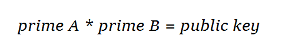

# Generating a public key

So far you have learnt that although finding the factors of small numbers is easy, even using the power of a computer it quickly becomes very difficult for large numbers. This demonstrates how hard maths protects encrypted messages. It explains why a good public key that creates strong cryptography needs to be a very large number. You have also learnt that a suitable public key must have *exactly* two factors (other than itself and 1) and that this can be achieved using prime numbers as factors.

Generating a very large number to use as a public key with exactly two factors might seem difficult if you approach the problem by examining potential keys and working out whether they have two factors or not.


The problem becomes much easier to solve if you approach it by first choosing two factors as private keys and then multiplying them together to make the public key. The two chosen factors must be **prime numbers**, because then they themselves have no factors. This guarantees that there is exactly one solution to the problem of finding the public key - the only way to do it is by multiplying these two prime numbers together.



To reiterate, in order to generate the public key, two prime numbers A and B need to be selected as the private keys. The public key is the product of the two - AB = A * B. This is called a **semiprime** - the product of two prime numbers.

Generating two private key primes to create a semiprime public key is much more straightforward than factoring a semiprime to find out the original two prime numbers. You can run [this program](resources/semi_prime_standalone.py) which does exactly this - you might want to use it to generate some private keys so that you can test them on the OctaPi later.

### Can I just choose my favourite prime number as my private key?

No. It is important that the prime numbers are *randomly chosen* - and randomness is something human beings are very bad at! In fact, many weaknesses in encryption are caused by the behaviour of human beings rather than the failure of technology. Let's investigate why randomness in a computer system (known as *entropy*) is important.

### Question 1

You have probably used some Python code similar to this before to generate a random integer:

```python
import random
print( random.randint(1, 10000) )
```

If we ask Python to generate large random numbers until one is prime, is that good enough to use as a private key?

### Investigation <iframe src="https://trinket.io/embed/python/cb4e94f1b4" width="100%" height="600" frameborder="0" marginwidth="0" marginheight="0" allowfullscreen mark="crwd-mark"></iframe> 

- Run the program by pressing F5 and look at the output. Then clear the output and run the program again. What do you see?

## \--- collapse \---

## title: Answer

Python's `randint` function generates numbers that appear random, but we added a starting number, or **seed**. If this seed is unchanged each time the code is run, the same sequence of numbers in the same order will always be generated. Using this function to choose our primes is not cryptographically secure, because if an attacker can determine the seed we used, they can simply use it to regenerate all the "random" numbers that our code generates.

\--- /collapse \---

### Question 2

So why can't we just use this function but not specify a seed?

### Investigation

- Delete the line `random.seed(12345)`.

- Run the program multiple times and compare the output. What happens now?

## \--- collapse \---

## title: Explanation

Although the numbers we have generated now *appear* to be different each time, they are still not genuinely random. This is because the algorithm used to generate the prime numbers still needs a seed - the seed still exists, we just don't know what it is! If we don't specify one, the seed is chosen in the background, usually based on a changing value such as the current time. This explains why each time we run the program the numbers are different and apparently random. The problem remains the same however: an attacker could still work out what the seed was, and regenerate the same random numbers we did with its help.

If you are interested in reading more about this topic, you can research the **Mersenne twister** algorithm which Python uses to generate its pseudo-random numbers.

\--- /collapse \---

### How can a computer generate a random number?

Because the amount of randomness (known as **entropy**) is extremely important when choosing prime numbers to use as private keys, a public key encryption algorithm must use a cryptographically secure source of random numbers. For example, Python can use the method `os.urandom()` in the `os` library.

[[[generic-theory-what-is-entropy]]]